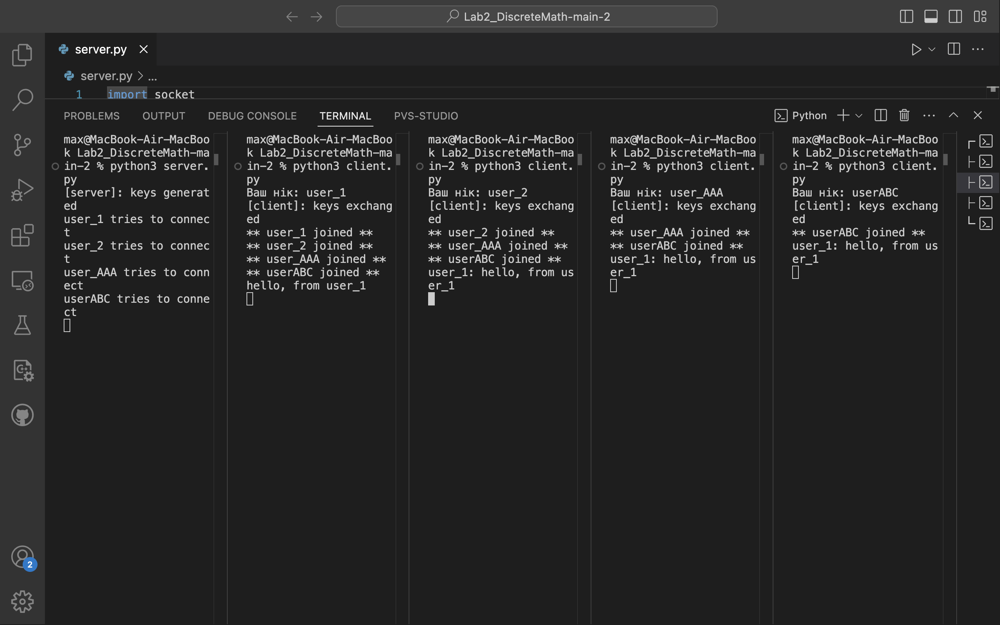

# Lab2_DiscreteMath

**Команда:**  
Дзьобан Максим, Шимановський Владислав

**Розподіл роботи:**  
- **Дзьобан Максим**: `Server.py`, `RSA.py`, `README.md`  
- **Шимановський Владислав**: `Client.py`, `README.md`


Розроблено алгоритм RSA обміну ключами та відповідне кодування повідомлень цими ключами.

Імплементовано **message integrity**, відповідно до якого обмін повідомленнями відбувається так:
1. Порахувати хеш повідомлення
2. Закодувати повідомлення
3. Надіслати у вигляді: `(hash, encrypted_message)`
4. Розкодувати повідомлення
5. Перевірити, чи обчислений хеш співпадає з отриманим

---

## Алгоритм RSA

### 1. Генерація ключів (`generate_keys`)
- Генеруються два прості числа `p`, `q`
- Обчислюється `n = p * q`
- Фіксується `e = 65537`
- Обчислюється `d`, що є оберненим до `e` за модулем φ(n)

### 2. Шифрування (`encrypt`)
- Кожен символ підноситься до `e` за модулем `n`, отримуємо `c`
- Масив `c` кодується у JSON + HEX

### 3. Дешифрування (`decrypt`)
- Декодуємо HEX → JSON
- Кожне число `c` дешифрується як `m = c^d mod n`

### 4. Хешування (`hash_message`)
- Додається SHA-256 до кожного повідомлення
- Це дозволяє виявити зміну повідомлення під час передачі

---

## Логіка роботи

### Клієнт (`client.py`)

Цей модуль реалізує **клієнтську частину шифрованого чату**, що використовує асиметричне RSA-шифрування для забезпечення **конфіденційності** та **цілісності** повідомлень. Весь обмін даними відбувається у зашифрованому вигляді, із використанням відкритих ключів, отриманих під час ініціалізації з'єднання.

#### `__init__(self, server_ip: str, port: int, username: str)`
Ініціалізує клієнтський об'єкт із заданими параметрами:

- `server_ip` — IP-адреса сервера.
- `port` — порт підключення.
- `username` — нікнейм користувача в чаті.

#### `initialize(self)`
Встановлює з'єднання з сервером:
- Надсилає ім’я користувача.
- Генерує RSA-пару ключів.
- Отримує публічний ключ сервера та надсилає власний.
- Запускає два потоки:
  - `reader()` — асинхронне читання.
  - `writer()` — відправка повідомлень.

#### `reader(self)`
Асинхронна функція, що працює в окремому потоці:
- Очікує зашифровані повідомлення від сервера.
- Розшифровує повідомлення приватним ключем клієнта.
- Перевіряє хеш для забезпечення цілісності.
- Виводить повідомлення у консоль.

#### `writer(self)`
Функція вводу повідомлень користувачем:
- Приймає текст із консолі.
- Обчислює хеш повідомлення.
- Шифрує повідомлення відкритим ключем сервера.
- Надсилає JSON-об'єкт у форматі:
  ```json
  {
    "h": "<хеш повідомлення>",
    "m": "<зашифроване повідомлення>"
  }

### Сервер (`server.py`)

Цей модуль реалізує серверну частину чату з підтримкою **асиметричного шифрування (RSA)** для захищеної передачі повідомлень між користувачами.  
Сервер запускається на локальному хості (`127.0.0.1`), приймає підключення, обмінюється публічними ключами з клієнтами та забезпечує зашифровану комунікацію між усіма учасниками чату.

#### `__init__(self, port: int)`
Ініціалізує сервер:
- Встановлює хост та порт
- Готує сокет до прослуховування
- Ініціалізує список клієнтів і словник публічних ключів

#### `start(self)`
Запускає сервер:
- Генерує пару RSA ключів
- Очікує підключення клієнтів
- Виконує обмін публічними ключами
- Запускає потік для кожного клієнта

#### `broadcast(self, plaintext: str, exclude: socket.socket | None)`
Надсилає зашифроване повідомлення всім клієнтам, окрім вказаного (наприклад, відправника):
- Хешує та шифрує повідомлення
- Розсилає JSON-об’єкт з хешем та зашифрованим текстом

#### `handle(self, client: socket.socket)`
Обробляє конкретного клієнта:
- Приймає зашифровані повідомлення
- Дешифрує їх приватним ключем сервера
- Перевіряє хеш і, якщо валідний — розсилає далі
- Обробляє відключення клієнта

---

## Запуск

```bash
python3 server.py
# у новому терміналі:
python3 client.py
```



